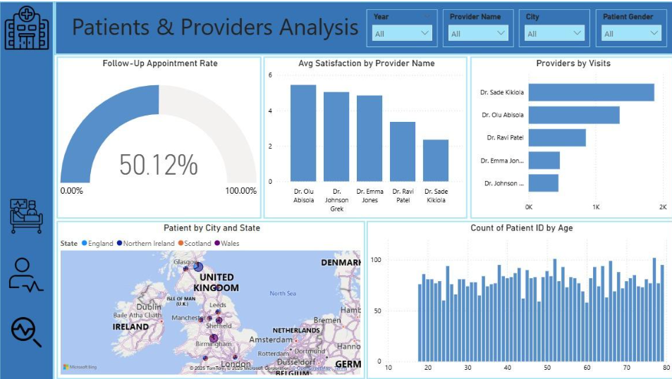
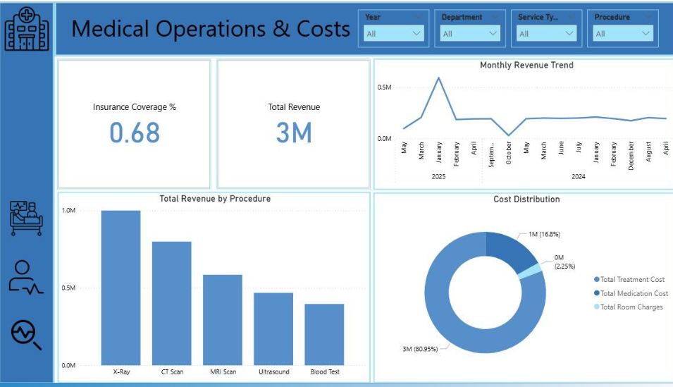
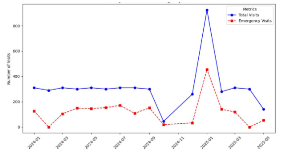

# 🏥 Healthcare Data Analysis Project

## 📌 Overview  
This is a collaborative project aimed at analyzing hospital data to uncover weaknesses in the healthcare system. The ultimate goal is to support decision-making that improves service quality, ensures better doctor and department management, and identifies areas where additional resources are needed.

## 🎯 Objectives  
- Detect weaknesses in the hospital system.  
- Evaluate doctors’ and departments’ performance.  
- Support better resource allocation (doctors, services, departments).  
- Provide actionable insights to improve healthcare services.  

## 🛠 Tools & Technologies  
- **Excel** → Data cleaning and preliminary analysis.  
- **SQL** → Data extraction, combining tables, and KPI calculation.  
- **Power BI** → Interactive dashboards and reports.  
- **Python (Colab)** → Advanced visualizations & machine learning.  
- **Machine Learning** → Predictive models for emergency visits & patient satisfaction.  

## 📊 Key Insights  
- Some doctors with low ratings still serve a large number of patients, indicating possible workload imbalance.  
- Departments such as **Pediatrics** and **Emergency** are understaffed and require more resources.  
- **X-ray** is the most requested and most expensive procedure → should be prioritized in insurance coverage.  
- Emergency visits often represent **~50% of total visits**, requiring continuous staffing and service readiness.  
- Costs remained stable overall, but showed anomalies (e.g., drop in October due to fewer visits).  
- **Hypertension** is the most frequent diagnosis among patients aged **60+**.  
- Outpatient services are the most common service type.  

## 🤖 Machine Learning Models  
- **Predicting Emergency Visits** → Used feature selection & multiple models to achieve the best accuracy.  
- **Predicting Patient Satisfaction** → Tried regression & classification approaches. Classification performed better after converting satisfaction into categories.  

> ⚠️ Note: The dataset is **not real hospital data** (dummy/simulated).  

## 🚀 How to Run  
1. Open the Colab notebook: [Google Colab Link]([#](https://colab.research.google.com/drive/1MCptkA1mbUyYv45hiFpwhhmgB72sRQVa?usp=sharing)).  
2. Install required libraries (Pandas, Matplotlib, Scikit-learn).  
3. Run the notebook to reproduce visualizations and machine learning models.  

## 📈 Dashboards & Visualizations  
Here are some examples from **Power BI & Python Visualizations**:  

  
  
  
